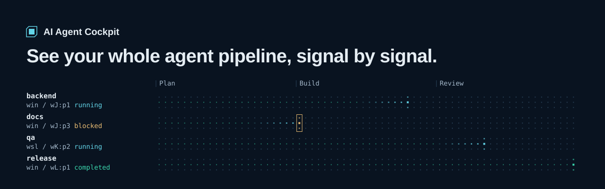
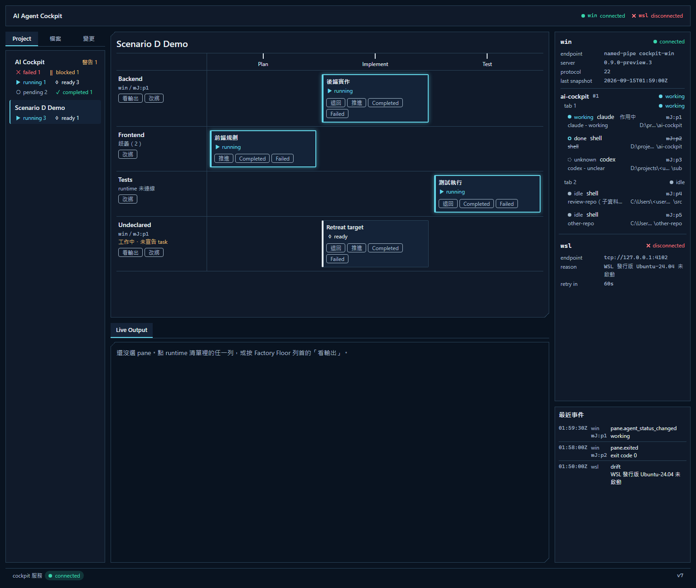

<!-- markdownlint-disable-next-line MD041 -->
[English](README.md) | [繁體中文](README.zh-TW.md)



# AI Agent Cockpit

A local, read-only dashboard for AI coding agents running in [HERDR](https://herdr.dev).
Cockpit turns HERDR panes into a live factory floor: which workstream each agent drives,
which stage it reached, and which one is waiting on you.

**Website:** <https://benjamin-teng.github.io/ai-cockpit/>



## What it does

- **Factory Floor.** Each project is a pipeline of stages, and its workstreams run side by side.
  Task cards show whether work is running, blocked or failed. Advance a task, send it back or
  mark it with one click.
- **One picture across Windows and WSL.** Cockpit connects to several HERDR runtimes at once
  and merges them, with a connection light for each.
- **Live Output in color.** Read any pane's recent output with its colors intact. It is a
  view, not a terminal: nothing you do there reaches the agent.
- **Files, diffs and git history.** Browse the repo a pane is working in: Markdown, PDF, HTML,
  side-by-side diffs and a commit graph, all read-only.
- **Agents report their own progress.** An agent announces its task and moves it forward with
  one HTTP call from its own pane. Cockpit never guesses. For now this works from Windows-side
  panes only.
- **Desktop alerts.** Get a notification when an agent is blocked or a task fails, and switch
  on alerts for the rest. Alerts appear while the Cockpit window is open or minimized and not in
  front. Click one and Cockpit opens that pane.
- **Opens like a desktop app.** A Windows shortcut starts Cockpit in the background and opens
  it in its own window. Close the window and Cockpit shuts down.
- **English or Traditional Chinese.** The dashboard picks one from your browser language and
  time zone, and a button in the top bar switches between the two.

## Read-only by design

Cockpit is an observer. It cannot type into a pane, prompt an agent or stop HERDR.

- The only HERDR calls it can make are `session.snapshot`, `pane.read` and
  `events.subscribe`. A sealed trait in `herdr-client` enforces this list at compile time.
- The dashboard listens on loopback only (`127.0.0.1:7770` by default). Every endpoint that returns
  or changes your data, including the live state feed (`/api/state` and `/ws`), checks the `Host`
  and `Origin` headers, so other web pages open in your browser cannot read the dashboard.
- Progress changes only when you click or when an agent reports it. Cockpit writes nothing to
  your repos or to HERDR. Its own files are `cockpit.state.json` and, with the desktop launcher,
  `cockpit.log` and `cockpit.update.json` (the time and result of the last update check).

## Get started

Windows is the tested platform, and HERDR inside WSL is supported. The desktop launcher needs
Chrome or Edge. The git views need `git` on `PATH`. Cockpit has been tested with HERDR
0.9.0-preview on Windows and HERDR 0.8.2 in WSL.

### Install (Windows x64)

Download `ai-cockpit-<version>-x64-setup.exe` from the
[latest release](https://github.com/Benjamin-Teng/ai-cockpit/releases/latest) and run it. It installs
for your account only, without admin rights, under `%LOCALAPPDATA%\Programs\AI Agent Cockpit`, and
adds an **AI Agent Cockpit** shortcut to the Start menu and, if you keep the option, the desktop.
Uninstall it from Windows **Settings > Apps**. The zip in the same release holds the same two
programs if you would rather not install.

- **First run.** The installer is not code-signed yet, so Windows SmartScreen may say
  "Windows protected your PC". Choose **More info**, then **Run anyway**. To check the download
  first, compare its hash with `SHA256SUMS.txt` from the same release.
- **Config.** The shortcut runs Cockpit in `%LOCALAPPDATA%\ai-cockpit`. Put your `cockpit.toml`
  there (start from `cockpit.example.toml` in the install folder). Without it Cockpit runs with
  zero configuration. Uninstalling keeps this folder.
- **Coming from `install-desktop.ps1`?** The installer replaces the desktop shortcut of the same
  name, and the new one does not pass `--config`. Move your `cockpit.toml` into
  `%LOCALAPPDATA%\ai-cockpit` together with the `cockpit.state.json` next to it, which holds your
  Factory Floor progress. Cockpit looks for the state file next to the config file, so moving only
  the config starts you from an empty board. If your config sets a relative `[state] path`, make it
  absolute or move that file too. Then delete the old `%LOCALAPPDATA%\ai-cockpit\bin` folder.

#### Updates

- **Automatic, installer only.** If you installed with the setup file, opening Cockpit from the
  shortcut while it is not already running checks GitHub for a newer stable release, at most once
  every 24 hours. If there is one, Cockpit asks first. Say yes and it downloads the installer,
  verifies it against the release's `SHA256SUMS.txt`, closes, updates and reopens by itself. If the
  download or the verification fails, Cockpit shows an error and opens the version you already have.
  Say no and it asks again at the next check. A pre-release is never offered.
- **The SmartScreen prompt usually appears only at the first install.** The prompt follows the
  "downloaded from the internet" mark that browsers put on files. Cockpit downloads the update
  itself, not through a browser, so the update carries no such mark.
- **It uses the network.** Each check sends one request to `api.github.com`. Set the environment
  variable `COCKPIT_NO_UPDATE_CHECK=1` to turn the check off completely.
- **Not updated automatically:** the zip, an `install-desktop.ps1` install and a build from
  source. Download a new version by hand from the
  [Releases page](https://github.com/Benjamin-Teng/ai-cockpit/releases).
- **Coming from v0.1.0?** That pre-release has no updater, so install the new version by hand
  once. Updates are automatic after that.
- **On a company network?** If your network goes through a system proxy or inspects TLS, Cockpit
  may not reach GitHub. It reads only the `HTTPS_PROXY` family of environment variables for a
  proxy and does not use the Windows certificate store. The check then fails without any message
  and Cockpit opens as usual; update by hand from the Releases page.

### Build from source

Building needs Rust (edition 2024). On Windows it also needs the Windows SDK, which comes with the
Visual Studio C++ build tools that Rust uses: the build embeds the app icon with its `rc.exe`.

```bash
git clone https://github.com/Benjamin-Teng/ai-cockpit.git
cd ai-cockpit
cargo run -p cockpit
```

Open <http://127.0.0.1:7770/>. Without a config file, Cockpit finds your local HERDR on its own.

To track a git repo, you do not need a config file: see [Add a repo as a project](#add-a-repo-as-a-project).
To describe your projects by hand, copy the example config. Before running, replace its `<user>`
placeholders, then list your HERDR runtimes, each project's stages and the pane every
workstream runs in. Cockpit reads `cockpit.toml` from the working directory, or the file you
pass with `--config`. Hand-written `[[project]]` sections keep working and sit next to the
projects you add on screen; if both use the same project id, the hand-written one wins.

```powershell
Copy-Item cockpit.example.toml cockpit.toml
cargo run -p cockpit
```

#### Desktop shortcut (Windows, optional)

```powershell
pwsh scripts/install-desktop.ps1
```

This builds a release, installs it under `%LOCALAPPDATA%\ai-cockpit\bin` and puts an
**AI Agent Cockpit** shortcut on your desktop. In this mode Cockpit shuts down about
10 seconds after you close its last window, so progress reports sent after that are lost.
Minimize the window instead of closing it while agents are working.

#### No HERDR yet?

```bash
cargo run -p cockpit --example ui_preview
```

This opens the dashboard at <http://127.0.0.1:7770/> with sample data.

## Add a repo as a project

You can add a git repo from the dashboard, without editing `cockpit.toml` or restarting:

1. Open a pane inside the repo in HERDR.
2. In the left column, open the **Project** tab. The repo is listed under **Detected repos**.
3. Click **Add**.

From then on, every pane whose working directory is inside that repo becomes one workstream, in
any worktree and any HERDR workspace, and each workstream gets one task card. A new project
starts with four stages (Plan, Implement, Review, Complete, named in the dashboard's language).
Use the project's **⋯** menu to rename it, edit its stages (rename, add, delete, reorder) or
remove it; changes apply at once. A pane in a linked git worktree is labelled with the worktree
folder's name. When you close a pane, its workstream and task progress go away with it. A pane that has exited but is still open in HERDR
disappears from the dashboard, but its progress is kept until the pane is really closed.

Things to know:

- A pane's working directory is read from HERDR's snapshot, which Cockpit refreshes every 30
  seconds by default. After you `cd` into another repo, the pane can take up to about 30 seconds
  to move there.
- Cockpit tells repos apart by their git common directory, so all worktrees of one repo are one
  project. A folder opened from Windows and again from WSL (`/mnt/d/...`) is listed as two
  repos.
- Projects you add are saved in `cockpit.state.json`. Without a config file, that file is
  `%LOCALAPPDATA%\ai-cockpit\cockpit.state.json`. This version writes state file version 3;
  see the [changelog](CHANGELOG.md) before going back to an older release.

## Let agents report progress

From inside an agent's own HERDR pane (Windows-side runtimes). In a project you added from a
repo, one line is enough: Cockpit finds the pane's task from the pane ID, so you do not need any
project or task ID.

```bash
# finish this stage and move to the next (no project or task ID needed)
curl -i -X POST http://127.0.0.1:7770/api/agent/advance -H "X-Herdr-Pane-Id: $HERDR_PANE_ID"
```

If Cockpit cannot find exactly one task to advance for the pane, the answer is 404
`no_task_for_pane` (no workstream is bound to it, or it has several tasks and none is current) or
409 `ambiguous_task` (several candidates). In both cases name the task explicitly, or `start` it
first. Like the other agent endpoints, it does not work from panes of a WSL
runtime. For hand-written projects you can also name the task explicitly:

```bash
# list the tasks bound to this pane
curl -s http://127.0.0.1:7770/api/agent/tasks -H "X-Herdr-Pane-Id: $HERDR_PANE_ID"
# declare the task you are working on
curl -i -X POST http://127.0.0.1:7770/api/agent/projects/cockpit/tasks/impl/start   -H "X-Herdr-Pane-Id: $HERDR_PANE_ID"
# finish this stage and move to the next
curl -i -X POST http://127.0.0.1:7770/api/agent/projects/cockpit/tasks/impl/advance -H "X-Herdr-Pane-Id: $HERDR_PANE_ID"
```

`cockpit` and `impl` are the project and task IDs from the example config; use your own.
In PowerShell, use `curl.exe` and `$env:HERDR_PANE_ID`. Marking a task completed or failed is
left to you. The full API, including a snippet you can paste into your project's `AGENTS.md`,
is in [`cockpit/README.md`](cockpit/README.md) (Traditional Chinese).

## How it is built

A Cargo workspace:

| Crate | Role |
|---|---|
| `herdr-client` | HERDR protocol client and transports (named pipe, Unix socket, child-process stdio for WSL); observer methods only |
| `cockpit-core` | Runtime and domain models, per-runtime driver, projection to the dashboard state; no HERDR types |
| `cockpit-herdr` | Translates HERDR into core types; the only crate that sees both sides |
| `cockpit-files` | File browsing with a root allowlist and safe paths |
| `cockpit-git` | A closed, read-only git query layer |
| `cockpit` | The program: axum HTTP and WebSocket, the embedded single-page UI, and the `cockpit-launch` desktop launcher |

Design decisions live in [`docs/adr/`](docs/adr/), the glossary in [`CONTEXT.md`](CONTEXT.md)
and the capability specs in [`openspec/specs/`](openspec/specs/).
